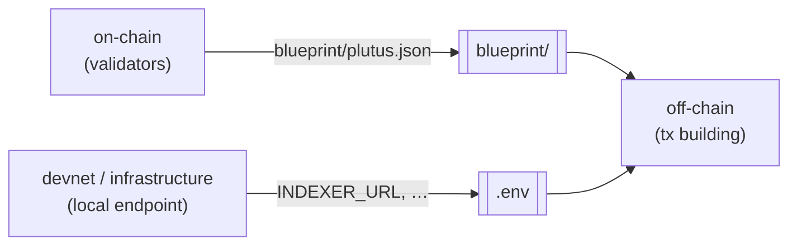

# cardano-init

[](https://github.com/input-output-hk/cardano-init/actions/workflows/ci.yml)
[](https://github.com/input-output-hk/cardano-init/actions/workflows/github-code-scanning/codeql)

### Go from zero to a running Cardano protocol in one command.

Pick a tool for each role you need — on-chain, off-chain, devnet, infrastructure, formal-methods — and `cardano-init` generates a monorepo where every component is **already wired together**, plus a worked end-to-end example that **builds and passes its tests out of the box**.

<p align="center">
  
</p>

```console
$ cardano-init --name my-protocol --on-chain aiken --off-chain meshjs --devnet yaci

my-protocol/
├── on-chain/     # Validators (aiken)
├── off-chain/    # Tx building (MeshJS)
├── devnet/       # Local throwaway chain (Yaci DevKit)
├── blueprint/    # shared CIP-57 contract interface
├── .env          # shared between components
├── Justfile      # Commands to build, test, and clean
├── AGENTS.md     # Agent brief: layout, contract, workflow, docs, skills (CLAUDE.md imports it)
└── README.md

$ cd my-protocol && just test
  ✓  All tests passed
```

## Why `cardano-init`?

- ⚡ **Zero to running in one command.** A wired-together monorepo that builds and passes its tests immediately — no glue code, no "step 12 of 30" setup guide.
- 🧩 **Mix and match, freely.** Any on-chain tool composes with any off-chain tool because components talk to a shared *contract*, not to each other. Swap MeshJS for Evolution SDK without touching your validators.
- 🤖 **Agent-native.** Machine-readable JSON on every command and a generated `AGENTS.md` in every project, so coding agents know what the project is and what to do next.
- 🩺 **Never stuck on setup.** A built-in dependency `doctor` detects your toolchains and tells you the exact installer to run for anything missing.
- 🧪 **Real example, not a stub.** Every stack ships the same worked gift-card scenario end-to-end, so what you generate actually runs.

> [!WARNING]
> **Early prototype — not for production yet.** Scope, flags, templates, and generated output **will change** without notice. Targeting a showcase build (DX.02) and a public Release Candidate (DX.05) — see the [Roadmap](docs/ROADMAP.md).

## Quick start (pre-release)

### Install

The fastest way. No toolchain required (Linux, macOS, Windows · x86_64 and arm64):

```bash
# macOS / Linux
curl --proto '=https' --tlsv1.2 -LsSf https://github.com/input-output-hk/cardano-init/releases/latest/download/cardano-init-installer.sh | sh
```

```powershell
# Windows (PowerShell)
irm https://github.com/input-output-hk/cardano-init/releases/latest/download/cardano-init-installer.ps1 | iex
```

Prefer a specific version or a manual download? Grab it from the [Releases page](https://github.com/input-output-hk/cardano-init/releases).

<details>
<summary><b>With Nix (flake)</b></summary>

```bash
# Install the CLI into your profile
nix profile add github:input-output-hk/cardano-init

# Or run it once, without installing
nix run github:input-output-hk/cardano-init -- --help
```
</details>

<details>
<summary><b>With Cargo</b> (requires a recent Rust toolchain, 2024 edition)</summary>

```bash
# From the published repo
cargo install --git https://github.com/input-output-hk/cardano-init

# Or from a clone
cargo install --path .
```
</details>

### Usage

```bash
# Interactive guided setup — the easiest way to start
cardano-init

# One-shot (non-interactive)
cardano-init --name my-protocol --on-chain aiken --off-chain meshjs --devnet yaci

# Fullstack: one tool for both on-chain and off-chain, as a single `protocol/` component
cardano-init --name my-protocol --fullstack scalus

# Preview what would be generated, without writing
cardano-init --name my-protocol --on-chain aiken --dry-run
```

Every generated project is driven by [`just`](https://just.systems): `just build`, `just test`, `just clean` (and per-component `just -f <dir>/Justfile dev` where a watch/daemon mode exists). Missing a toolchain? Run the built-in dependency [`doctor`](docs/ROADMAP.md) and it tells you exactly which installer to use.

## How it works

You choose tools for **roles**. Only the directories for selected roles are created, and a base layer (top-level `Justfile`, README, `.env`, `blueprint/`) wires them together.

| Role | What it does | Multiple tools? |
|------|--------------|-----------------|
| `on-chain` | Validators / smart-contract logic; produces the CIP-57 blueprint | no |
| `off-chain` | Transaction building & submission | no |
| `devnet` | Local throwaway chain to develop & integration-test against | no |
| `infrastructure` | Indexers, node providers, chain followers | **yes** |
| `formal-methods` | Specification & verification | no |

The magic is the **interface contract**: on-chain components always emit `blueprint/plutus.json`, and whatever provisions a local endpoint writes standard vars (like `INDEXER_URL`) into `.env`. Consumers read those and degrade gracefully when blank. Because components talk to the *contract* rather than to each other, mixing and matching tools Just Works.



Every tool writes to and reads from those two seams (`blueprint/` and `.env`) — never from each other — so a swap on one side never breaks the other.

Every on-chain and off-chain template ships the **same worked example — a gift card**: a one-shot minting policy that mints a unique token gated by a specific UTxO, plus a `redeem` validator that releases a locked gift when the token is burned. Because all tools demonstrate the same scenario with a shared parameter ABI, a generated project builds and tests end-to-end, and any on-chain tool composes with any off-chain one (e.g. an Aiken contract driven by the Scalus off-chain, or a Scalus contract driven by the MeshJS off-chain).

**Fullstack tools.** Some tools (e.g. Scalus) implement both on-chain and off-chain in one language. Pick such a tool for both roles (e.g., `--fullstack scalus`, or `--on-chain scalus --off-chain scalus`) and instead of two folders you get a single unified **`protocol/`** component. It still writes the standard `blueprint/plutus.json` and reads `.env`, so it composes with devnet, formal-methods, and infrastructure.

**Compatibility checks.** Not every off-chain tool can talk to every provider and each devnet/infra provider serves some set of them. `cardano-init` knows these and **stops before generating** a project whose off-chain tool can't reach a chain from its selected providers. The error lists the providers that *would* work; pass `--ignore-warning` to scaffold the combination anyway. Interactive mode simply hides the incompatible options.

## For coding agents

`cardano-init` is built to be driven by LLMs, end to end:

- **Machine-readable interface.** `cardano-init list --format json` enumerates every role and tool; any command accepts `--format json` and emits a stable envelope with machine-readable error `code`s and a `context` that says how to fix each error. One-shot mode (`--name …`) is fully non-interactive, so an agent can scaffold in a single call. See [TECH_SPEC](docs/TECH_SPEC.md) §2.
- **Generated `AGENTS.md`.** Every project ships an `AGENTS.md` (plus a `CLAUDE.md` that imports it) tailored to the chosen stack: the layout, the interface contract and its invariants, the exact `just` workflow, per-tool official doc links, and the [cardano-dev-skills](https://github.com/cardano-foundation/cardano-dev-skills) most relevant to that stack. An agent dropped into a fresh project knows what it is and what to do next.
- **Works in tandem with [cardano-dev-skills](https://github.com/cardano-foundation/cardano-dev-skills).** That Cardano Foundation skill set is the *knowledge* layer (writing validators, building transactions, debugging on-chain failures); `cardano-init` is the *scaffolding* layer. The generated `AGENTS.md` points agents at the plugin and the right skills for the stack they're in.

## Status

Early prototype. Tools currently in the registry (✅ available · 🧪 experimental, opt-in via `--allow-experimental` · ⬜ planned). Infrastructure is multi-tool and provisioned via `cardano-up`; every other role takes one tool.

| On-chain | Off-chain | Devnet | Infrastructure | Formal methods |
|----------|-----------|--------|----------------|----------------|
| ✅ Aiken | ✅ MeshJS | ✅ Yaci DevKit | ✅ Kupo | 🧪 Blaster |
| ✅ Scalus | ✅ Scalus | | ✅ Ogmios | |
| ✅ Plinth | ✅ Evolution SDK | | ✅ Dolos | |
| ⬜ Pebble | 🧪 Tx3 | | ✅ Tx Submit API | |
| ⬜ Plutarch | ⬜ Lucid Evolution | | ✅ Cardano Node | |
| ⬜ Opshin | ⬜ Blaze | | ✅ Cardano Node API | |
| | ⬜ Elm Cardano | | ✅ Dingo | |
| | ⬜ PyCardano | | | |

## How it relates to `aikup`, `cardano-up`, and friends

`cardano-init` is a **project scaffolder**, not a version manager or an environment manager. It runs once, generates a wired-together monorepo, and steps out. That makes it complementary to (not a replacement for) the per-tool installers in the ecosystem.

These sit at different layers: `cardano-init` decides *what tools your project uses and how they compose*, while `aikup` / `cardano-up` install and manage *the toolchains and infrastructure those tools need*. The two meet at the dependency [`doctor`](docs/ROADMAP.md): when toolchains are missing, `cardano-init` advises the right installer (`aikup` for Aiken, `cardano-up` for the infrastructure role) rather than reinventing them.

By design, `cardano-init` is **not** a package or version manager: it does not pin or upgrade tool versions, manage dependencies after generation, or migrate existing projects. There is no `cardano-init update`.

## Infrastructure providers

The **infrastructure** role is backed by [`cardano-up`](https://github.com/blinklabs-io/cardano-up) (requires Docker). Unlike the other roles, infrastructure is **multi-tool**: select any combination with repeated `--infra` flags and they are provisioned together as a single project-scoped `cardano-up` context, aggregated into one `infra/` component. Each provider publishes its connection details to the project `.env`, which off-chain components read automatically.

| Provider | Flag | Publishes to `.env` | Upstream |
|----------|------|---------------------|----------|
| Kupo | `--infra kupo` | `INDEXER_URL` | https://github.com/CardanoSolutions/kupo |
| Ogmios | `--infra ogmios` | `OGMIOS_URL` | https://ogmios.dev |
| Dolos | `--infra dolos` | `DOLOS_GRPC_URL`, `NODE_SOCKET_PATH` | https://github.com/txpipe/dolos |
| Tx Submit API | `--infra tx-submit-api` | `TX_SUBMIT_URL` | https://github.com/blinklabs-io/tx-submit-api |
| Cardano Node | `--infra cardano-node` | `NODE_SOCKET_PATH` | https://github.com/IntersectMBO/cardano-node |
| Cardano Node API | `--infra cardano-node-api` | `CARDANO_NODE_API_URL` | https://github.com/blinklabs-io/cardano-node-api |
| Dingo | `--infra dingo` | `INDEXER_URL`, `NODE_SOCKET_PATH` | https://github.com/blinklabs-io/dingo |

```bash
# An indexer + query bridge over a shared node (cardano-up pulls in cardano-node):
cardano-init --name my-protocol --off-chain meshjs --infra kupo --infra ogmios

# Bring the stack up (provisions the services and writes connection details into .env. Long-running):
just -f infra/Justfile dev
```

- **Dolos and Dingo are self-contained nodes**: No separate `cardano-node`. Each provides its own `NODE_SOCKET_PATH`, and Dingo also serves a Blockfrost-compatible API as `INDEXER_URL`.
- **One chain-index per project**: `INDEXER_URL` has a single slot, so Kupo and Dingo are alternatives, not additive.

## User Documentation

So far, this README is the only user docs.

## Development Documentation

Internal CI (smoke tests, installer recipes, devnet):

[](https://github.com/input-output-hk/cardano-init/actions/workflows/scheduled-smoke.yml)
[](https://github.com/input-output-hk/cardano-init/actions/workflows/installer-recipes.yml)
[](https://github.com/input-output-hk/cardano-init/actions/workflows/devnet-smoke.yml)

| Doc | Purpose |
|-----|---------|
| [docs/PRD.md](docs/PRD.md) | Product requirements: who it's for, problem, scope, success metrics |
| [docs/ARCHITECTURE.md](docs/ARCHITECTURE.md) | System design, module structure, data model, pipeline |
| [docs/TECH_SPEC.md](docs/TECH_SPEC.md) | Exact contracts, schemas, algorithms, edge cases |
| [docs/ROADMAP.md](docs/ROADMAP.md) | Phases & milestones (DX.02, DX.05) |
| [docs/ADDING_A_TOOL.md](docs/ADDING_A_TOOL.md) | Contributor guide for integrating a new tool |
| [docs/RELEASING.md](docs/RELEASING.md) | How to cut a release and publish prebuilt binaries (cargo-dist) |


```bash
cargo build       # build
cargo test        # run tests
cargo fmt         # format
cargo clippy      # lint
```

A Nix flake is provided. Use `nix develop` for a dev shell with the Rust toolchain, or `nix build .#cardano-init` to build the package.
