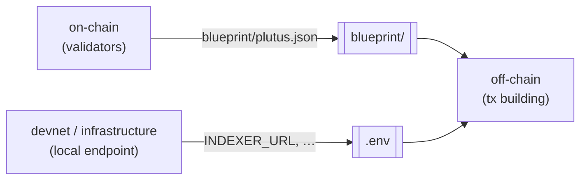

# How it works

## Roles

You choose tools for **roles**. Only the directories for the roles you select are created, and a base layer (top-level `Justfile`, `README.md`, `.env`, `blueprint/`) wires them together.

| Role | What it does | Directory | Multiple tools? |
|------|--------------|-----------|-----------------|
| `on-chain` | Validators / smart-contract logic; produces the CIP-57 blueprint | `on-chain/` | no |
| `off-chain` | Transaction building and submission | `off-chain/` | no |
| `devnet` | A local throwaway chain to develop and integration-test against | `devnet/` | no |
| `infrastructure` | Indexers, node providers, chain followers | `infra/` | **yes** |
| `formal-methods` | Specification and verification | `formal-methods/` | no |

## The interface contract

What makes this work is the **interface contract**. On-chain components always emit `blueprint/plutus.json`, and whatever provisions a local endpoint writes standard variables (like `INDEXER_URL`) into `.env`. Consumers read those and degrade gracefully when they're blank. Because components talk to the *contract* rather than to each other, you can mix and match tools freely.



Every tool writes to and reads from those two seams (`blueprint/` and `.env`), never from each other, so swapping one side never breaks the other.

## The worked example: a gift card

Every on-chain and off-chain template ships the **same worked example: a gift card**. It's a one-shot minting policy that mints a unique token gated by a specific UTxO, plus a `redeem` validator that releases a locked gift when the token is burned.

Because all tools demonstrate the same scenario with a shared parameter ABI, a generated project builds and tests end to end, and any on-chain tool composes with any off-chain one. For example, an Aiken contract can be driven by the Scalus off-chain, or a Scalus contract by the MeshJS off-chain.

## Fullstack tools

Some tools (for example Scalus) implement both on-chain and off-chain in one language. Pick such a tool for both roles and, instead of two folders, you get a single unified **`protocol/`** component:

```bash
cardano-init --name my-protocol --fullstack scalus
# equivalent to
cardano-init --name my-protocol --on-chain scalus --off-chain scalus
```

The `protocol/` component still writes the standard `blueprint/plutus.json` and reads `.env`, so it composes with devnet, formal-methods, and infrastructure tools like any other.

## Compatibility checks

Not every off-chain tool can talk to every provider, and each devnet or infrastructure provider serves only some of them. `cardano-init` knows these relationships and **stops before generating** a project whose off-chain tool can't reach a chain through any of its selected providers. The error lists the providers that *would* work.

- Pass `--ignore-warning` to scaffold the combination anyway (the stop becomes a warning).
- In interactive mode, incompatible options are simply hidden.

## Experimental tools

Some tools are marked **experimental**: either the upstream tool is still pre-release, or its `cardano-init` integration isn't yet fully build-green. They still generate, but you have to opt in:

- In one-shot or JSON mode, pass `--allow-experimental` (`-e`). Without it, selecting an experimental tool is an error and nothing is generated.
- In interactive mode, choosing an experimental tool asks for confirmation (default **No**).

`cardano-init list` tags these tools as `[experimental]`.

## Networks

Generated projects target the **preview** testnet by default. To switch, edit `CARDANO_NETWORK` in the generated `.env`.
