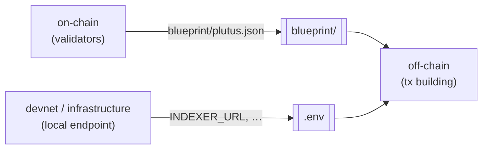

# How it works

## Roles

You choose a tool for each **role** you need. `cardano-init` creates a directory only for the roles you select, plus a base layer (top-level `Justfile`, `README.md`, `.env`, `blueprint/`) that connects them.

| Role | What it does | Directory | Multiple tools? |
|------|--------------|-----------|-----------------|
| `on-chain` | Validators (smart-contract logic); produces the CIP-57 blueprint | `on-chain/` | no |
| `off-chain` | Transaction building and submission | `off-chain/` | no |
| `devnet` | A local test chain to develop and run integration tests against | `devnet/` | no |
| `infrastructure` | Indexers, node providers, chain followers | `infra/` | **yes** |
| `formal-methods` | Specification and verification | `formal-methods/` | no |

## The interface contract

Components connect through an **interface contract** with two parts:

- Every on-chain component writes its compiled validators to `blueprint/plutus.json`.
- Every component that starts a local chain endpoint writes its address (for example `INDEXER_URL`) to `.env`.

Other components read these two files and keep working when a value is empty. No component reads another component's files directly, so you can replace a tool on one side and the other side still works.



## The worked example: a gift card

Every on-chain and off-chain template includes the same example, a **gift card**. It has two validators:

- a one-shot minting policy, which mints a unique token and can run only once because it requires a specific UTxO to be spent;
- a `redeem` validator, which releases a locked gift when that token is burned.

All tools implement this example with the same parameters. As a result, any on-chain tool works with any off-chain tool. For example, the Scalus off-chain code can drive an Aiken contract, and the MeshJS off-chain code can drive a Scalus contract.

## Fullstack tools

Some tools, such as Scalus, write both the on-chain and the off-chain code in one language. If you select such a tool for both roles, you get one **`protocol/`** component in place of two directories:

```bash
cardano-init --name my-protocol --fullstack scalus
# same result as
cardano-init --name my-protocol --on-chain scalus --off-chain scalus
```

`protocol/` also writes `blueprint/plutus.json` and reads `.env`, so it works with devnet, formal-methods, and infrastructure tools.

## Compatibility checks

Each off-chain tool can connect to some providers and not to others. `cardano-init` knows which pairs work. If the off-chain tool you select cannot reach any of the providers you select, it **stops before generating the project** and lists the providers that would work.

- Pass `--ignore-warning` to generate the project anyway. The error becomes a warning.
- Interactive mode hides the options that would not work.

## Experimental tools

A tool is **experimental** when the tool itself is still in development, or when its `cardano-init` template does not yet pass every build check. Experimental tools still generate, but you must opt in:

- In one-shot or JSON mode, pass `--allow-experimental` (`-e`). Without it, selecting an experimental tool is an error and nothing is generated.
- In interactive mode, you are asked to confirm. The default answer is **No**.

`cardano-init list` marks these tools as `[experimental]`.

## Networks

Generated projects use the **preview** testnet. To change the network, edit `CARDANO_NETWORK` in the generated `.env`.
